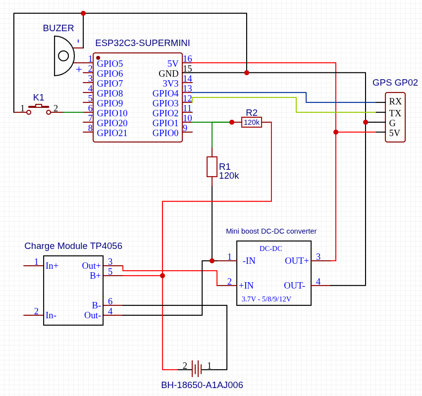
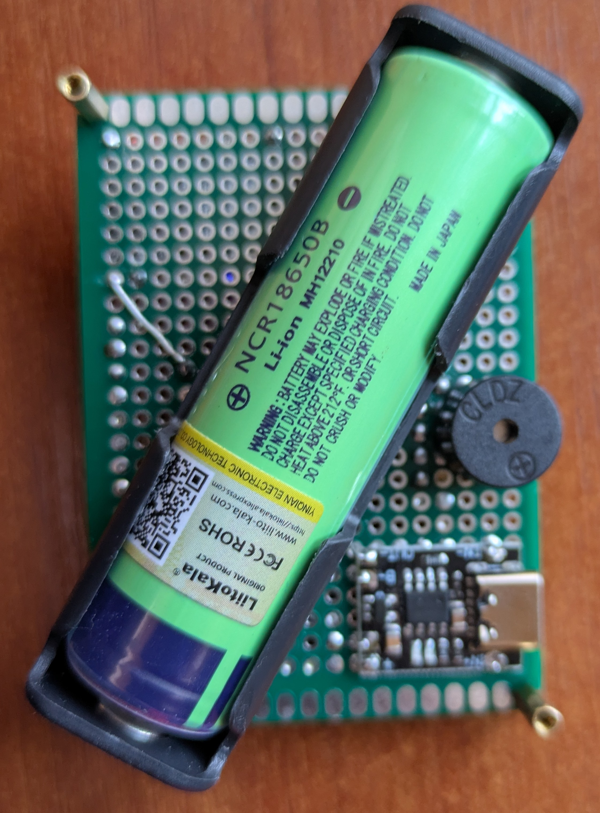
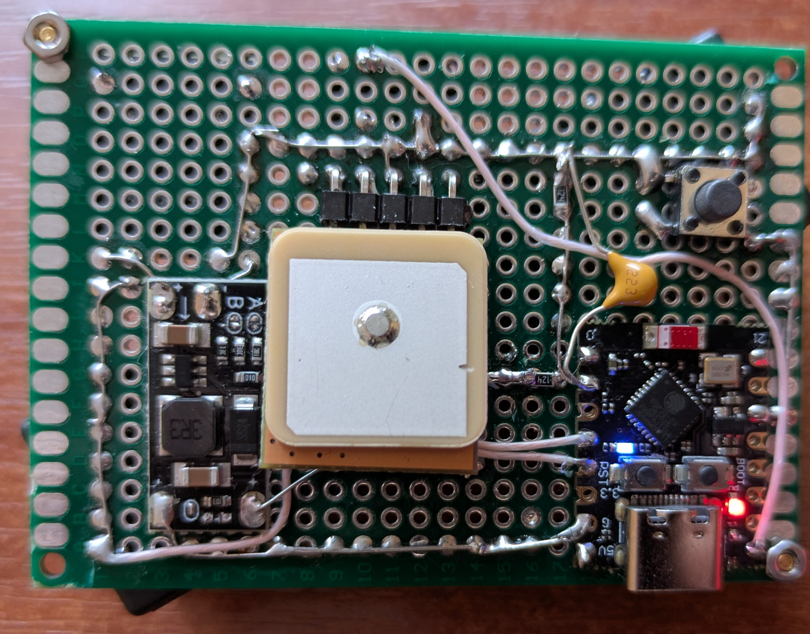
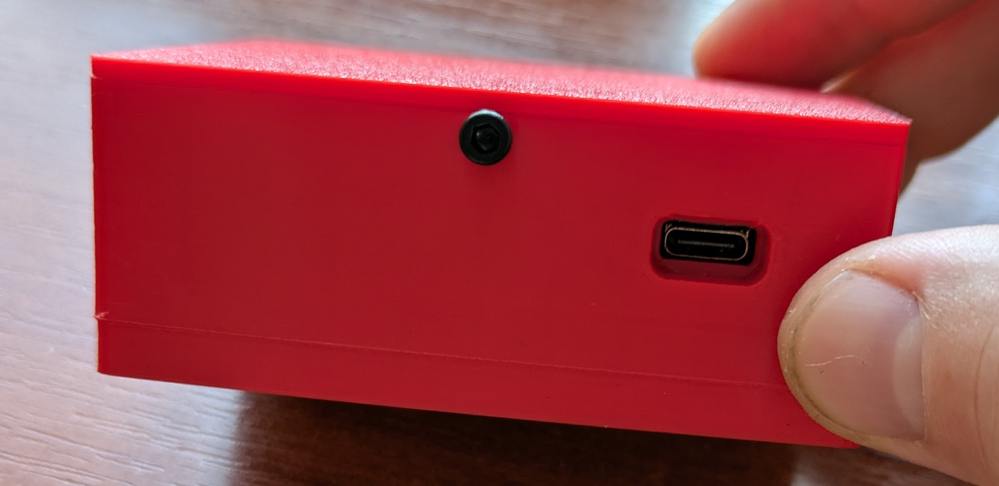

# ESP Open Tracker

An open-source GPS tracker built on the ESP32-C3 microcontroller, designed for real-time vehicle or asset tracking via the OsmAnd protocol.


## Features

- **Real-time GPS tracking** — sends location data to any OsmAnd-compatible server (e.g. m2m.eu,  Traccar)
- **Adaptive send interval** — adjusts automatically based on movement:
  - Stationary: every 30 seconds
  - Moving: every 10 seconds
  - Turning (>7°): every 2 seconds
- **Black box** — stores track points to LittleFS flash when offline, automatically uploads when connection is restored
- **Battery monitoring** — measures voltage via ADC with resistor divider, sends battery level with each packet
- **Power management** — low battery warning via buzzer, deep sleep on critical battery level (<2.9V)
- **Filtering zone** — replaces real coordinates with home location if coordinates outside of a configurable radius to handle gps spoofing
- **Wi-Fi manager** — web-based configuration portal (AP mode) for managing Wi-Fi networks and server settings
- **Auto reconnect** — automatically reconnects to saved Wi-Fi networks in the background
- **LED indicators** — non-blocking LED feedback for Wi-Fi connection and successful data transmission
- **Buzzer alerts** — audio feedback on Wi-Fi connect and low battery

## Hardware

- **MCU**: ESP32-C3 Super Mini
- **GPS**: GP-02 (NMEA, 9600 baud, UART on GPIO3/GPIO4)
- **Battery**: Li-ion, monitored via voltage divider on GPIO1
- **Buzzer**: Passive buzzer on GPIO5
- **Button**: Long press on GPIO10 opens config portal

All key parameters are defined in `include/TrackerConfig.h`:

```cpp
#define TRACKER_DEVICE_ID        "esp-nav-001"
#define TRACKER_INTERVAL_STATIC  30000
#define TRACKER_INTERVAL_MOVING  10000
#define TRACKER_INTERVAL_TURNING 2000
#define TRACKER_SPEED_THRESHOLD  1.0f
#define TRACKER_BEARING_THRESHOLD 7.0f
#define TRACKER_HOME_LAT         49.123456
#define TRACKER_HOME_LNG         32.123456
#define TRACKER_HOME_RADIUS_KM   0.2f
```

## OsmAnd Protocol

Data is sent via HTTP GET to your server:

```
http://<host>:<port>/?id=<device_id>&lat=...&lon=...&timestamp=...
  &speed=...&bearing=...&altitude=...&hdop=...&satellites=...
  &batt=...&free_kb=...&distance=...
```

## Config Portal

Long press the button on GPIO10 to open the configuration portal:

- Connect to Wi-Fi AP: **ESP Nav** / password: **12345678**
- Open browser: **http://192.168.4.1**
- Add/remove Wi-Fi networks
- Set server host and port

## Dependencies

- [TinyGPS++](https://github.com/mikalhart/TinyGPSPlus)
- Arduino framework for ESP32 (PlatformIO)

## Schematic



## Bill of Materials

| #  | Component                     | Qty | Notes                        |
| -- | ----------------------------- | --- | ---------------------------- |
| 1  | ESP32-C3 Super Mini           | 1   | Main microcontroller         |
| 2  | GP-02 GPS module              | 1   | NMEA, 9600 baud              |
| 3  | Resistor 120kΩ               | 2  | Voltage divider     |
| 4  | Passive buzzer                | 1   | 3.3V compatible              |
| 5  | Tactile push button           | 1   | Config portal trigger        |
| 6  | DC-DC boost converter (5V)    | 1   | Powers GPS module            |
| 7  | TP4056 charger module (USB-C) | 1   | Li-ion battery charging      |
| 8  | 18650 Li-ion battery with pin | 1   | Main power source            |
| 9 | 18650 battery holder          | 1   |                              |
| 10 | Capacitor 100nF (or 220nF)    | 1   | ADC noise filtering on GPIO1 |
| 11 | Perfboard 50×70mm            | 1   | For soldering components     |
| 12 | Jumper wires                  | —  | For connections              |
| 13 | Knurled nuts M3                  | 8  | For case and covers              |

## Assembly

### Board assembly





### Case with board assembly





## 3D Printed Case

Print files are located in the `3d/` folder:

| File | Description |
|------|-------------|
| [`case_box_tracker.STL`](3d/case_box_tracker.STL) | Main enclosure body |
| [`case_lid.STL`](3d/case_lid.STL) | Enclosure lid |
| [`case_mount.STL`](3d/case_mount.STL) | Bottom lid (can be used as mount) |

## License

LGPL3


